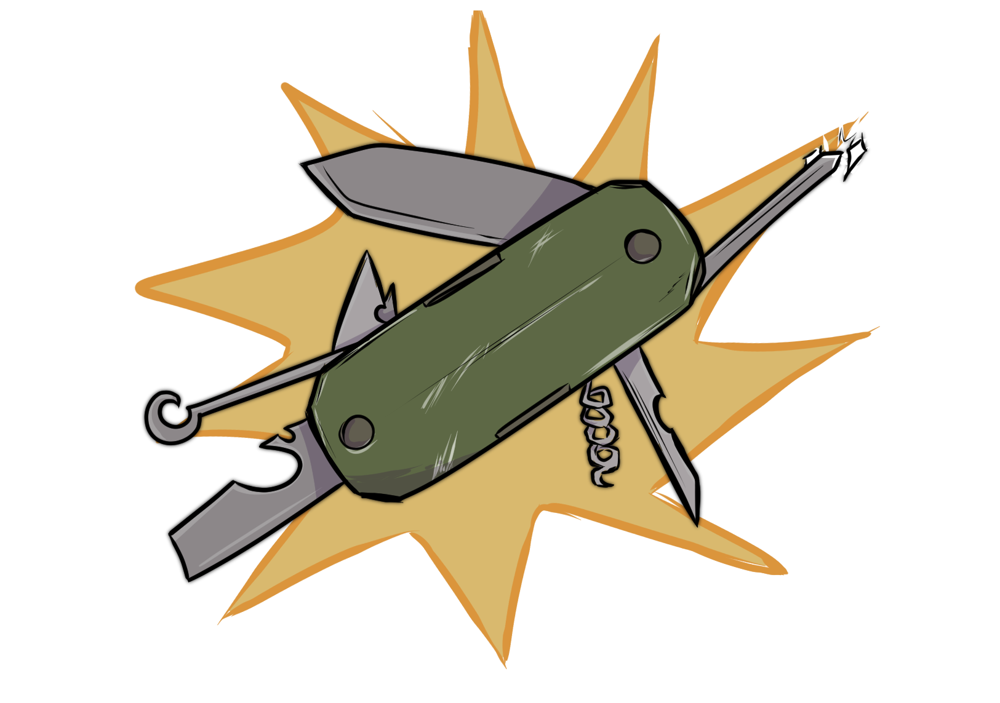

# Definiciones

<figure><figcaption>
La estadística, desde un punto de vista aplicado, puede entenderse como una herramienta al servicio de la ciencia y la toma de decisiones.
</figcaption></figure>
