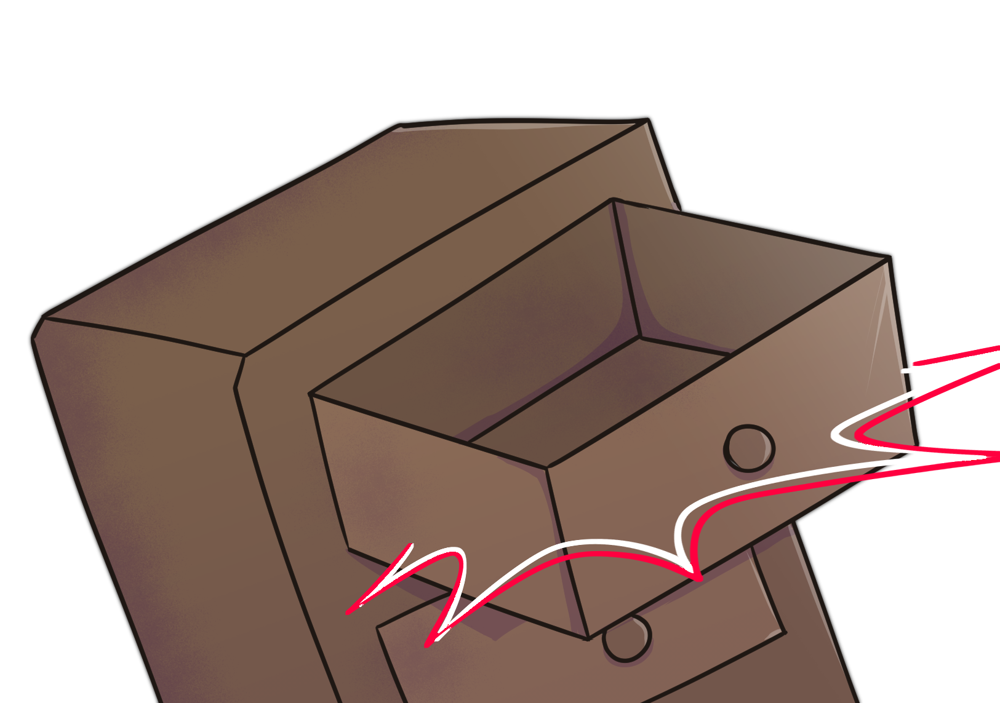
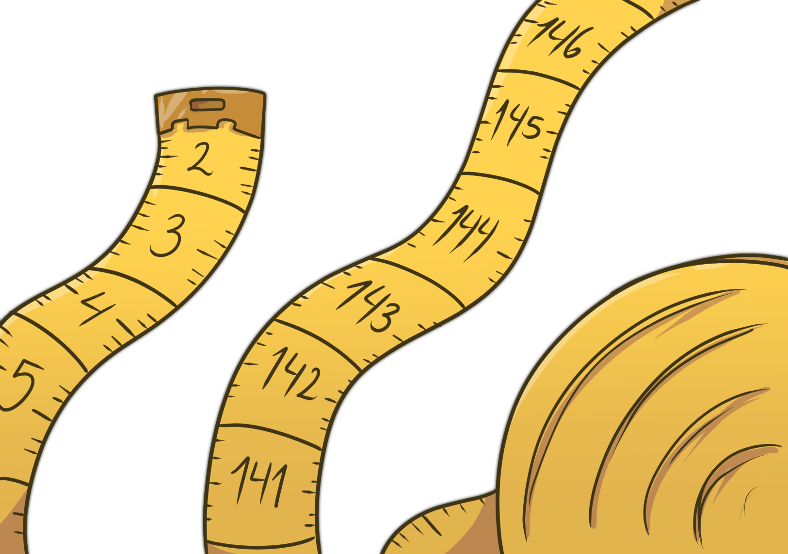

# Medida

<figure><figcaption>
Las variables categóricas se caracterizan por tomar uno de una lista de valores excluyentes entre sí. Los sujetos sólo pueden "estar en un cajón" a la vez.
</figcaption></figure> <figure><figcaption>
Las variables cuantitativas se caracterizan por usar representaciones numéricas para capturar un atributo de los sujetos.
</figcaption></figure>

